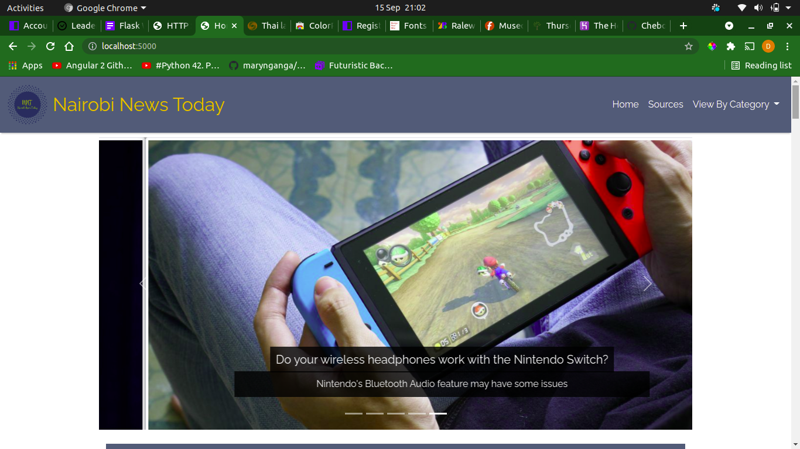
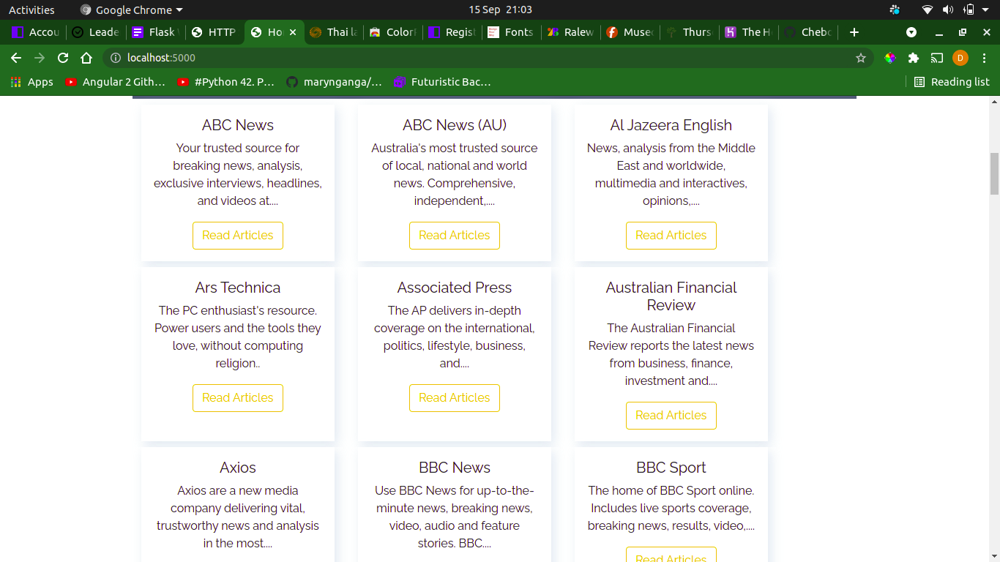
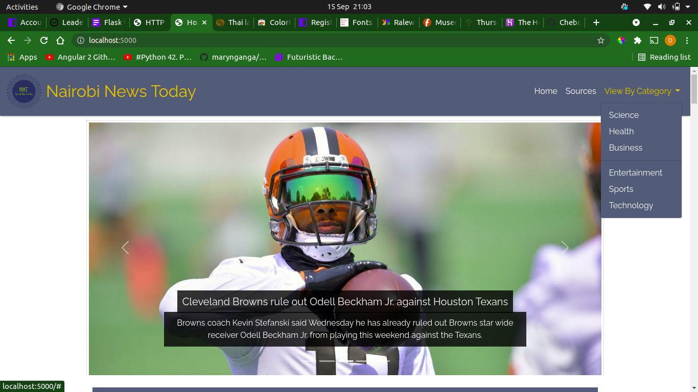

# Nairobi News Today

## By [Derrick Cheboi](https://github.com/CheboiDerrick/)

## Description
Nairobi News Today is a web app that allows a user to access news from different sources. The user can view the news sources on the homepage and select a particular source to view their news artciles

## Application Behaviour
These are the behaviours/features that the application implements for use by a user.

A user should be able to:
* Provide the user with the news sources on the homepage
* Redirect a user to the articles of a particular source on a different path
* Display all the articles of a source on the new path
* Provide a link to the official site of each article on the artciles page
* Allow the user to also view the different categories and be redirected to the articles on clicking
* The web app make use of the [News API Org](https://newsapi.org/)

## Screenshots
* Home Page

* News Sources

* Categories

* Articles by Source

* Articles by Category

## SetUp / Installation Requirements
### Prerequisites
* python3.8
* pip3
* pipenv
* Git and Github

### Cloning
* In your terminal:
        
        $ git clone https://github.com/CheboiDerrick/news-app.git
        $ cd news-app.

## Running the Application
* Obtain an API key from [News Api](https://newsapi.org/)
* Set up your API key in the start.sh file
* To run the application, in your terminal:
        
        $ chmod a+x start.sh
        $ ./start.sh

* Open your browser and navigate to http://localhost:5000 to view the web app

        
## Technologies and Languages Used
* Python -(3.8)
* Flask

## License
[MIT](https://github.com/CheboiDerrick/news-app/blob/main/LICENSE) 

&copy;2021
